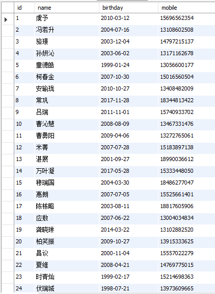

# Mock

一个伪造数据的框架，用来方便随机生成一些数据。

## 基本用法

引用依赖Maven：

```xml
<dependency>
    <groupId>com.github.developframework</groupId>
    <artifactId>mock-text</artifactId>
    <version>${version.mock}</version>
</dependency>
```

提供一个模板字符串（template），可以内嵌占位符`${...}`，占位符将会被随机值替换。

生成一个：

```java
MockClient mockClient = new MockClient();
String result = mockClient.mock("random text: ${ string }");
System.out.println(result);
```

```
random text: pXFMyu
```

批量生成：

```java
List<String> list = mockClient.mockBatch("random text: ${ string }", 5);
list.forEach(System.out::println);
```

```
random text: PDsUUg
random text: zcVIFN
random text: YFORrL
random text: rnYSpZ
random text: fCmrto
```

从输入流引入模板：

```java
String result = mockClient.mock(inputStream, charset);
```

从输入流引入模板批量生成

```java
List<String> list = mockClient.mockBatch(inputStream, charset, quantity);
```

### 占位符

占位符的格式：

```
${<type> | [param1=value1, param2=value2]}
```

+ type是占位符的类型
+ param=value是可选的参数，对随机值做约束，boolean型的`param=true`可以省略直接写`param`

比如：

```
${ string | length=10, uppercase }
```

将会生成一个10位长度的全大写的随机字母字符串

目前所有内置的占位符

#### string

随机字符串

```
${ string | length=10, letters, numbers, uppercase, lowercase }
```

| 可用参数  | 说明       | 默认值 | 随机示例                 | 示例结果   |
| --------- | ---------- | ------ | ------------------------ | ---------- |
| length    | 字符串长度 | 6      | ${ string \| length=10 } | UvmNUqOACS |
| letters   | 使用字母   | true   | ${ string \| letters }   | EETnby     |
| numbers   | 使用数字   | false  | ${ string \| numbers }   | 236914     |
| uppercase | 使用大写   | false  | ${ string \| uppercase } | LHKRDU     |
| lowercase | 使用小写   | false  | ${ string \| lowercase } | mgpval     |

+ `uppercase`和`lowercase`都写和都不写时，大小写混合。

#### number

随机数值

```
${ number | min=0, max=100, decimals}
```

| 可用参数 | 说明     | 默认值           | 随机示例                           | 示例结果          |
| -------- | -------- | ---------------- | ---------------------------------- | ----------------- |
| min      | 最小值   | 0                | ${ number \| min=0 }               | 4                 |
| max      | 最大值   | Double.MAX_VALUE | ${ number \| min=100 }             | 20                |
| decimals | 采用小数 | false            | ${ number \| decimals }            | 82.30656374435402 |
| digit    | 有效位数 | null             | ${ number \| decimals, digit = 2 } | 91.02             |

#### boolean

随机布尔值

```
${ boolean }
```

#### date

随机日期

```
${ date | range=1y, pattern=yyyy-MM-dd, future }
```

| 可用参数 | 说明                                             | 默认值     | 随机示例                        | 示例结果   |
| -------- | ------------------------------------------------ | ---------- | ------------------------------- | ---------- |
| range    | 日期范围，相对于系统日期浮动，格式：1y1M1d1h1m1s | 1y         | ${ date \| range=1y }           | 2018-03-20 |
| pattern  | 日期格式化                                       | yyyy-MM-dd | ${ date \| pattern=yyyy/MM/dd } | 2018/03/20 |
| future   | 随机一个未来的日期，默认是已过的日期             | false      | ${ date \| future }             | 2018-05-16 |

#### datetime

随机时间

```
${ datetime | range=1y, pattern=yyyy-MM-dd, future }
```

可用参数和**date**类型一致，区别是`pattern`参数默认值是yyyy-MM-dd HH:mm:ss

#### mobile

随机手机号码

```
${ mobile }
```

#### personName

随机人名

```
${ personName | length=3 }
```

| 可用参数 | 说明     | 默认值 | 随机示例                    | 示例结果 |
| -------- | -------- | ------ | --------------------------- | -------- |
| length   | 名字字数 | 3      | ${ personName \| length=3 } | 王悦议   |

#### quote

这个类型本身不生成随机值，引用之前已生成的随机值

```java
String result = mockClient.mock("first text: ${ string | id=first }\nsecond text: ${quote | id=first}");
```
给之前的占位符设置一个`id` 在后面使用**quote**类型引用之前的值

```
first text: ZRBYQf
second text: ZRBYQf
```

### 自定义占位符

继承随机生成器接口`com.github.developframework.mock.random.RandomGenerator`

```java
// <T> 是随机值的类型
public interface RandomGenerator<T> {

    // 描述如何生成随机值
    T randomValue(MockPlaceholder mockPlaceholder, MockCache mockCache);

    // 占位符类型的名称
    String name();
}
```

```java
public class MyRandomGenerator implements RandomGenerator<String>{
    @Override
    public String randomValue(MockPlaceholder mockPlaceholder, MockCache mockCache) {
        // 获得参数
        String param = mockPlaceholder.getParameterOrDefault("param", String.class, "default value");
        
        // 返回随机值
        return null;
    }

    @Override
    public String name() {
        return "myPlaceholder";
    }
}
```

给MockClient注册自定义随机生成器

```java
RandomGenerator[] customRandomGenerators = new RandomGenerator[] {
    new MyRandomGenerator()
};
mockClient.getRandomFactory().customRandomGenerators(customRandomGenerators);
```

## Mock-db

给数据库表随机填充数据框架

引用依赖Maven：

```xml
<dependency>
    <groupId>com.github.developframework</groupId>
    <artifactId>mock-db</artifactId>
    <version>${version.mock}</version>
</dependency>
```

提交一条随机数据

```java
DBMockClient client = new DBMockClient();
try {
    int count = client.byMysql()
            .database("test")
            .table("person")
            .field("name", "${ personName }")
            .field("birthday", "${ date | range=20y }")
            .field("mobile", "${ mobile }")
            .submit(driver, url, user, password);

    System.out.println(count);
} catch (SQLException e) {
    e.printStackTrace();
}
```



批量提交随机数据：

```java
int quantity = 100;
int count = client.byMysql()
    // 忽略表配置
    .submitBatch(driver, url, user, password, quantity);
```

